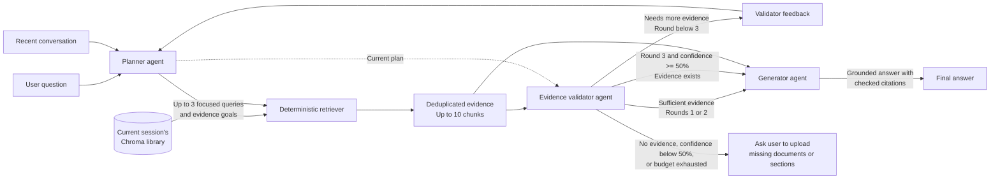

# Folio · Agentic document research

A local POC with a Next.js/TypeScript research workspace and a single-worker
FastAPI backend. LangGraph plans searches, retrieves from a temporary Chroma
library, checks the evidence, and generates a cited answer using Groq.

## Setup and run

Use Python 3.11+, uv, and Node.js 22+ with npm. Run all Python commands through this
project's interpreter: copied virtual-environment activation scripts and console
launchers can still point to the original Streamlit project.

```sh
cd /Users/npt/Oracle/workspaces/ideas/agentic-rag-chatbot
# Create .venv only if it does not already exist:
python3 -m venv .venv
uv pip sync requirements.txt --python .venv/bin/python
test -f .env || cp .env.example .env
# Set GROQ_API_KEY in .env if not already configured.
cd frontend
npm ci
```

Terminal 1 — backend:

```sh
cd /Users/npt/Oracle/workspaces/ideas/agentic-rag-chatbot
.venv/bin/python -m uvicorn rag_chat.api:app --host 127.0.0.1 --port 8000 --workers 1
```

Terminal 2 — frontend:

```sh
cd /Users/npt/Oracle/workspaces/ideas/agentic-rag-chatbot/frontend
npm run dev
```

Open **http://127.0.0.1:3000**. API documentation is at
**http://127.0.0.1:8000/docs**. Next.js proxies `/api/*` to Python; override the
server-only `API_ORIGIN` variable if using a different backend port. The Groq
key stays in Python. Shell environment values override `.env`.

For a compiled frontend, use `npm run build` then `npm start`. Use one API worker:
multiple workers do not share this POC's in-memory libraries. Restarting Python
clears all documents, chats, and operation history.

## Use the workspace

1. Choose or drop PDF, DOCX, TXT, or Markdown files and select **Process documents**.
2. Wait for the per-file result. A bad file does not prevent later files processing.
3. Ask a question. The Research panel shows live planning, individual searches,
   evidence checks, and follow-up research.
4. A complete answer appears after citation validation. Click a numbered citation
   to inspect its exact source passage; **View research** opens an earlier answer's trace.
5. Clear session removes both documents and the conversation. On a narrow screen,
   use the document and research buttons in the header to open the drawers.

Uploads are limited to 20 MB each and 10 indexed documents per session. Extraction
supports text PDFs, DOCX body paragraphs/tables, and UTF-8 text/Markdown; OCR,
encrypted PDFs, DOCX headers/footers, and embedded objects are unsupported. Each
document is capped at 2 million extracted characters and 10,000 chunks. Identical
bytes are deduplicated; changed bytes count as a new document. Indexing failures
roll back the document; rollback failure requires clearing the session.

The initial upload downloads the local MiniLM ONNX embedding model (about 80 MB).
Later sessions reuse its cache. Uploads work without a Groq key; answering requires
a key and connectivity. Questions, bounded recent conversation, and retrieved
excerpts are sent to Groq. Original files are not retained after processing;
multipart parsing may temporarily spool an upload to a temporary file, which is
closed after it is read. Extracted text and vectors stay in memory.

## Agent and session behavior

The graph is `planner → retrieve → validate → generate`, with a feedback edge from
validation to planning. It allows 3 rounds, 3 searches per round, 3 hits per search,
and 10 unique chunks. The planner resolves follow-ups from the last 5 exchanges.



The planner and validator only propose and assess work. The retriever is deterministic:
it can search only the current browser session's Chroma collection, and the generator
receives only the accumulated evidence that passed the graph's routing checks.

Structured replies are validated with Pydantic and get one repair attempt. The
first two validation attempts require a `sufficient` decision. On the third,
confidence of at least 0.5 allows generation even when some evidence is missing;
below 0.5 the chatbot requests the missing documents or sections. Confidence is
the validator model's own estimate, not a calibrated probability of correctness.
Duplicate retrievals or a full 10-chunk evidence set do not prevent the third
validation attempt; the full set is reused when no further chunks can be added.
An empty evidence set never passes. Research shows confidence and threshold
acceptance, and the generator must identify unresolved gaps in a fallback answer.
Numbered citations are checked for valid references; this does not prove
every generated claim is correct.

Each browser tab keeps an opaque session ID in `sessionStorage`. Python owns the
chat history. Refresh restores that session, including completed answers and
traces. After one hour of inactivity it expires; polling does not extend the idle
timer. Active work is protected from expiry and restarts the timer on completion.
Clearing and conflicting requests are rejected while an operation is running.

Disconnecting does not cancel an accepted operation. Research completes in Python;
the browser reads session status and polls active work to recover the result.
It never automatically resubmits a question. Traces show observable actions and
explicit agent outputs, not private model reasoning. There is no database,
authentication, multi-tenancy, or external tracing configuration. This is a local
development POC, not a publicly hosted service.

## API

Except for health and session creation, requests include `X-Session-ID`.

| Method/path | Purpose |
|---|---|
| `GET /api/health` | Availability and answering configuration |
| `POST /api/sessions` | Create a temporary library |
| `GET /api/session` | Read documents, messages, traces, and operation status |
| `DELETE /api/session` | Delete an idle session |
| `POST /api/documents` | One multipart `file`; indexed, duplicate, or failed result |
| `POST /api/chat` | JSON `question`; SSE progress and a terminal answer or error |

Missing session headers return 400, expired sessions 410, conflicting work 409,
and oversized uploads 413. Graph/provider errors after streaming starts arrive as
an `error` event and are not added to the conversation.

## Validation

```sh
# From project root; offline mocks, no credentials/model download:
.venv/bin/python -m pytest -q
cd frontend
npm run typecheck
npm test
npm run build
npx playwright install chromium
npm run test:e2e
```

If the browser download is unavailable but Google Chrome is installed, use
`PLAYWRIGHT_CHANNEL=chrome npm run test:e2e`. Tests launch a separate automated
browser profile. The frontend lockfile uses the Yarn npm-package mirror because
the local Oracle gateway certificate could not be verified for the default npm
registry; TLS verification remains enabled.

Development and production builds use Next.js's Webpack option; the default
Turbopack CSS compiler could not bind its helper port in this environment.

Browser tests launch a separate test-only API on 8100 and Next.js on 3100, using
real in-memory Chroma, deterministic embeddings, and mocked Groq output. They
exercise uploads, citations, evidence gaps, refresh/disconnect recovery, expiry,
clearing, and mobile drawers. Screenshots are written under `frontend/test-results`.
The test server's expiry endpoint exists only in `tests/fake_api.py`.

Optional real-embedding test (may download model files):

```sh
RAG_TEST_REAL_EMBEDDINGS=1 .venv/bin/python -m pytest -q tests/test_embedding_smoke.py
```

Regenerate Python pins with:

```sh
uv pip compile pyproject.toml --extra test --universal --python-version 3.11 -o requirements.txt
```

Next.js and Python are independently installable; `frontend/package-lock.json`
and `requirements.txt` record their resolved dependencies.
